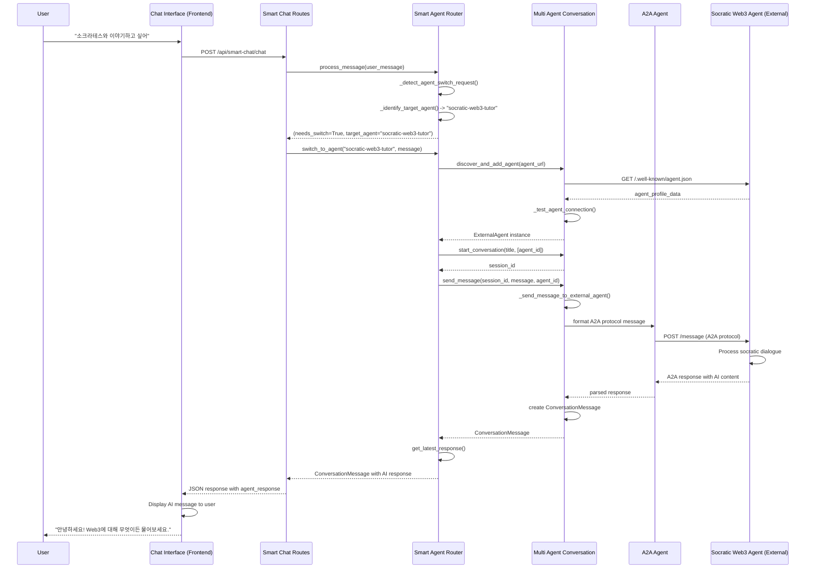

# Web Chat Natural Language Processing - Class Diagram

## 웹 채팅에서 자연어 입력부터 AI 응답까지의 클래스 다이어그램

```mermaid
classDiagram
    %% Frontend Classes
    class ChatInterface {
        -messageInput: HTMLInputElement
        -messageContainer: HTMLElement
        -sendButton: HTMLElement
        +sendMessage(message: string)
        +displayMessage(message: ChatMessage)
        +showTypingIndicator()
        +hideTypingIndicator()
    }

    %% Web Routes Layer
    class WebRoutes {
        +chat_page(request: Request): HTMLResponse
        +templates: Jinja2Templates
    }

    %% Smart Chat API Layer
    class SmartChatRoutes {
        -smart_router: SmartAgentRouter
        +smart_chat(chat_request: ChatMessage): Dict
        +quick_connect_socrates(): Dict
        +get_current_agent(): Dict
        +analyze_user_message(message: string): Dict
    }

    %% Core Smart Routing System
    class SmartAgentRouter {
        -conversation_manager: MultiAgentConversation
        -current_session_id: Optional[str]
        -current_agent_id: Optional[str]
        -agent_profiles: Dict[str, AgentProfile]
        -switch_patterns: List[str]
        
        +process_message(user_message: str): Tuple[bool, str, str]
        +switch_to_agent(agent_id: str, initial_message: str): Dict
        +send_message_to_current_agent(message: str): Dict
        +get_latest_response(timeout_seconds: int): ConversationMessage
        -_detect_agent_switch_request(message: str): Tuple
        -_identify_target_agent(message: str): str
        -_recommend_agent_by_keywords(message: str): str
    }

    %% Agent Profile Management
    class AgentProfile {
        +agent_id: str
        +name: str
        +aliases: List[str]
        +keywords: List[str]
        +description: str
        +url: str
        +capabilities: List[str]
        +personality_traits: List[str]
    }

    %% Multi-Agent Conversation System
    class MultiAgentConversation {
        -local_agent: A2AAgent
        -external_agents: Dict[str, ExternalAgent]
        -conversations: Dict[str, ConversationSession]
        -messages: Dict[str, List[ConversationMessage]]
        -client: httpx.AsyncClient
        
        +discover_and_add_agent(agent_url: str): ExternalAgent
        +start_conversation(title: str, participant_ids: List[str]): str
        +send_message(session_id: str, content: str, recipient_id: str): ConversationMessage
        +get_conversation_history(session_id: str, limit: int): List[ConversationMessage]
        -_send_message_to_external_agent(agent_id: str, message: ConversationMessage): ConversationMessage
        -_test_agent_connection(agent: ExternalAgent): bool
    }

    %% External Agent Management
    class ExternalAgent {
        +agent_id: str
        +name: str
        +description: str
        +url: str
        +capabilities: Dict[str, Any]
        +protocol_version: str
        +status: str
        +last_contact: Optional[datetime]
    }

    %% Local A2A Agent
    class A2AAgent {
        +agent_id: str
        +agent_name: str
        +connections: Dict[str, AgentConnection]
        +message_queue: List[Dict]
        +status: str
        +client: httpx.AsyncClient
        
        +connect(target_agent_url: str, target_agent_id: str): bool
        +send_message(target_agent_id: str, message_type: str, payload: Dict): Dict
        +receive_message(message: Dict): Dict
        +ping_agent(target_agent_id: str): Dict
    }

    %% Message Models
    class ConversationMessage {
        +message_id: str
        +conversation_id: str
        +sender_id: str
        +sender_name: str
        +recipient_id: Optional[str]
        +message_type: str
        +content: str
        +timestamp: datetime
        +metadata: Dict[str, Any]
    }

    class ConversationSession {
        +session_id: str
        +title: str
        +participants: List[str]
        +created_at: datetime
        +status: str
        +message_count: int
        +last_activity: datetime
    }

    class ChatMessage {
        +message: str
        +auto_switch: bool
    }

    %% External Socratic Agent (Remote)
    class SocraticWeb3Agent {
        <<external>>
        +agent_id: "socratic-web3-tutor"
        +name: "Socratic Web3 AI Tutor"
        +url: "https://socratic-web3-ai-tutor.vercel.app/api/a2a"
        +capabilities: ["socratic_dialogue", "web3_education"]
        
        +receive_message(message: A2AMessage): A2AResponse
        +handshake(handshake_data: Dict): Dict
    }

    %% HTTP Communication
    class HTTPXClient {
        <<library>>
        +get(url: str): Response
        +post(url: str, json: Dict): Response
    }

    %% Template Engine
    class Jinja2Templates {
        <<library>>
        +TemplateResponse(template: str, context: Dict): HTMLResponse
    }

    %% Relationships
    ChatInterface -->|HTTP POST /api/smart-chat/chat| SmartChatRoutes
    WebRoutes -->|renders| ChatInterface
    
    SmartChatRoutes -->|uses| SmartAgentRouter
    SmartChatRoutes -->|creates| ChatMessage
    
    SmartAgentRouter -->|manages| AgentProfile
    SmartAgentRouter -->|uses| MultiAgentConversation
    SmartAgentRouter -->|analyzes| ChatMessage
    
    MultiAgentConversation -->|manages| A2AAgent
    MultiAgentConversation -->|discovers| ExternalAgent
    MultiAgentConversation -->|creates| ConversationSession
    MultiAgentConversation -->|creates| ConversationMessage
    MultiAgentConversation -->|communicates via| HTTPXClient
    
    A2AAgent -->|connects to| SocraticWeb3Agent
    A2AAgent -->|sends A2A protocol messages via| HTTPXClient
    
    ExternalAgent -.->|represents| SocraticWeb3Agent
    
    WebRoutes -->|uses| Jinja2Templates

    %% Data Flow Notes
    note for ChatInterface "1. User types: '소크라테스와 이야기하고 싶어'"
    note for SmartAgentRouter "2. Analyzes natural language patterns\n3. Detects agent switch request\n4. Identifies target: socratic-web3-tutor"
    note for MultiAgentConversation "5. Discovers external agent\n6. Establishes A2A connection\n7. Sends user message"
    note for SocraticWeb3Agent "8. Processes message\n9. Returns AI response"
    note for ChatInterface "10. Displays AI response to user"
```

## 주요 처리 흐름 (Sequence)



## 핵심 설계 패턴

1. **Router Pattern**: SmartAgentRouter가 자연어 분석 후 적절한 에이전트로 라우팅
2. **Strategy Pattern**: 다양한 에이전트 프로필과 스위칭 패턴
3. **Observer Pattern**: ConversationMessage를 통한 메시지 흐름 추적
4. **Adapter Pattern**: A2A 프로토콜을 통한 외부 에이전트 통신
5. **Factory Pattern**: ExternalAgent 인스턴스 생성 및 관리

## 확장성 고려사항

- 새로운 에이전트 추가 시 AgentProfile만 등록하면 됨
- 자연어 패턴은 switch_patterns에 정규식으로 추가 가능  
- A2A 프로토콜 표준을 따르므로 다른 A2A 호환 에이전트들과 통신 가능